- [Curso GIT y GITHUB Platzi](#curso-git-y-github-platzi)
  - [Flujo básico de trabajo con GIT](#flujo-básico-de-trabajo-con-git)
- [RAMAS CONFLICTOS](#ramas-conflictos)
  - [Definición](#definición)
  - [merge de un archivo concreto](#merge-de-un-archivo-concreto)
  - [ejemplo práctico](#ejemplo-práctico)
  - [git reset y git rm](#git-reset-y-git-rm)
    - [git rm](#git-rm)
    - [git reset](#git-reset)
  - [Creación de ramas](#creación-de-ramas)
    - [Enviar ramas a github](#enviar-ramas-a-github)
- [Github](#github)
  - [Llaves públicas y llaes privadas](#llaves-públicas-y-llaes-privadas)
    - [Generando mis llaves public/private](#generando-mis-llaves-publicprivate)
    - [crear conexión ssh con github](#crear-conexión-ssh-con-github)
  - [Tags](#tags)
- [Nuevos comandos (makigas)](#nuevos-comandos-makigas)
  - [git-restore](#git-restore)
- [Curso de Git y GitHub](#curso-de-git-y-github)
- [TEMA 1](#tema-1)
  - [¿Cómo funciona GIT?](#cómo-funciona-git)
  - [Primeros pasos](#primeros-pasos)
  - [Usando usuarios diferentes de manera local](#usando-usuarios-diferentes-de-manera-local)
  - [Tipos de add](#tipos-de-add)
  - [Dejar de seguir archivos](#dejar-de-seguir-archivos)
  - [Como revisar el log](#como-revisar-el-log)
  - [Creando alias](#creando-alias)
- [TEMA 2](#tema-2)
  - [Uso de diff](#uso-de-diff)
  - [Reset, sacando del stage](#reset-sacando-del-stage)
  - [Modificar mensaje del commit (--amend)](#modificar-mensaje-del-commit---amend)
  - [Reset --soft modificando un commit](#reset---soft-modificando-un-commit)
  - [Reset - -mixed - -hard - - reflog](#reset----mixed----hard-----reflog)
  - [Renombrar y eliminar archivos con GIT](#renombrar-y-eliminar-archivos-con-git)
    - [Con terminal](#con-terminal)
    - [Con sistema de archivos](#con-sistema-de-archivos)
  - [Flujo básico de trabajo con GIT](#flujo-básico-de-trabajo-con-git-1)
- [TEMA 3 - RAMAS CONFLICTOS Y TAGS](#tema-3---ramas-conflictos-y-tags)
  - [Definición](#definición-1)
    - [Fast-forwars](#fast-forwars)
- [Tags o etiquetas](#tags-o-etiquetas)
- [Comandos útiles](#comandos-útiles)
- [git branch -M main](#git-branch--m-main)
  - [config -l](#config--l)
  - [config --global](#config---global)
  - [git init](#git-init)
  - [git add](#git-add)
  - [git status](#git-status)
  - [git commit](#git-commit)
  - [git log](#git-log)
  - [git show](#git-show)
  - [git log](#git-log-1)
  - [git diff](#git-diff)
  - [git add -p](#git-add--p)
  - [git rm](#git-rm-1)
  - [git mv](#git-mv)
  - [.gitignore](#gitignore)
  - [git checkout](#git-checkout)
  - [git reset](#git-reset-1)
  - [git commit --amend](#git-commit---amend)
  - [git revert](#git-revert)
  - [git branch](#git-branch)
  - [git checkout](#git-checkout-1)
  - [git branch](#git-branch-1)
  - [git checkout -b branch_name](#git-checkout--b-branch_name)
  - [git branch -d branch_name](#git-branch--d-branch_name)
  - [git merge branch_name](#git-merge-branch_name)
  - [git log --graph --oneline](#git-log---graph---oneline)
  - [git log --graph --online --all](#git-log---graph---online---all)
  - [git merge --abort](#git-merge---abort)
  - [git add remote](#git-add-remote)
  - [git remote -v](#git-remote--v)
  - [git remote show origin](#git-remote-show-origin)
  - [git push](#git-push)
  - [git pull](#git-pull)
  - [git branch -r](#git-branch--r)
  - [git fetch](#git-fetch)
  - [git log origin/nombreRama](#git-log-originnombrerama)
  - [git merge origin/master](#git-merge-originmaster)
  - [git remote update](#git-remote-update)
  - [git push -u origin branch_name](#git-push--u-origin-branch_name)
  - [git push --delete origin branch_name_here](#git-push---delete-origin-branch_name_here)
  - [git rebase branch_name_here](#git-rebase-branch_name_here)
  - [git push -f](#git-push--f)
  - [git remote set-url](#git-remote-set-url)
  - [git remote rm](#git-remote-rm)
- [Tema 5 Undoing mistakes](#tema-5-undoing-mistakes)

---

añado texto

añado otro texto
git s

# Curso GIT y GITHUB Platzi

Instalar git, lo mejor agregar un repo ppa
`add-apt-repository ppa:git-core/ppa`
actualizamos
`apt update`
instalamos git  
`apt install git`

## Flujo básico de trabajo con GIT

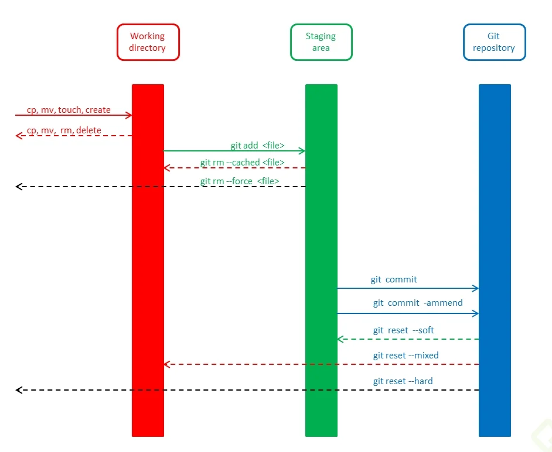

Cuando hacemos `git init` en el directorio raíz de nuestro proyecto pasan dos cosas:

1. se crea un espacio en memoria RAM llamado `staging`, donde se irán agregando los cambios es decir cuando hacemos un `git add .`
2. Se crea un repositorio, es la carpeta `.git` del proyecto, es donde se guardan los cambios definitivos del proyecto los `commits`. El nombre por defecto de la rama principal del repo es `master`. Cuando se hace el commit se le da un identificador.

Actualmente GIT quiere cambiar este nombre de la rama pricipal por el de `main` si queremos que por defecto la rama que se cree se llame main hacemos:

```
git config --global init.defaultBranch main
```

Ahora cda vez que haga `git init` me creará la rama principal del repo como `main`.

parea renombrar la rama master a main

```
git branch -M master main
# or  
git branch -M main (situado en master)

```

Para poder hacer este cambio la rama necesita tener un commit hecho.

Cuando hemos cometido un error y queremos recuperar ese archivo o proyecto tal y como lo teníamos en la rama master, es decir en el último commit hacemos un `git checkout`.

La rama principal del repo se llama `master` es donde tenemos la sucesión de todos los commits. Existe un puntero `HEAD` que apunta al commit dnd nos encontramos actualmente, normalmente el último. Ese HEAD se puede mover haciendo un `checkout`.

# RAMAS CONFLICTOS

## Definición

Una rama no es más que una línea del tiempo alterativa a la línea principal (master). En esa rama podemos hacer nuestras modificaciones añadir funcionalidades al proyecto sin alterar el proyecto principal, si posteriormente se aceptan los cambios y todo funciona bien se puede agregar al proyecto principal, rama master, lo que llamamos merge.
Hay tres tipos de merge:

1. Fast-forward => éste se da cuando en la rama master no ha habido ningún cambio desde que se separó la rama secundaria así que simplemente GIT incorpora los cambios a la principal cerrando la secundaria.
2. Merge automático => es cuando sí ha habido cambios en la rama principal (master) pero no en archivos comunes entre la rama secundaria y master así que git vuelve a incorporar los cambios sin ningún problema.
3. Merge manual=> en este caso git solicita una solución manual ya que que la rama secundaria ha modificado archivos que también se encuentran en la principal. Así una vez resulete el cnflicto se debe realizar un merge commit.

A estas ramas se les da un nombre para identificarlas por ejemplo rama 'uix del carrito'. Cuando en la rama master se encuentra un bug se suele crear una rama para solucionar ese fallo, normalmente a esa rama se le llama `hotfix` o `bugfixing`. Una vez soolucionado se hace el merge entre master y el hotfix, al finalizar el merge tenemos la última versión de master a esta última versión se le llama `HEAD`.

## merge de un archivo concreto

```
git checkout --patch otherbranch folder1/update.txt
```
sto abrirá un asistente para repasar cada parte del códigoe ir aceptando cambios

## ejemplo práctico

Vamos haciendo commits y con `git log` los podemos ver. Ahora bien si nos hemos equivocado podemos volver atrás usando un reset. Hay dos tipos de reset:

1. `git reset --hard`, lo que hace es apuntar el HEAD al commit indicado y se revierten todos los cambios, nos queda el directorio de trabajo como en el commit indicado.
2. `git reset --soft`, lo que hace es apuntar el HEAD al commit indicado pero el directorio de trabajo sigue igual, entonces cuando volvemos ahacer un commit se crea uno nuevo abandonando los otros  
   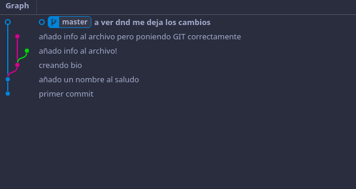

con `git log --stat` puedo ver un log y un resumen de los cambios en cada commit.

Para movernos entre commits usamos checkout `git checkout idDelCommit` ceso ambia todo el proyecto pero puedo hacer el checkout solo de un archivo `git checkout idDelCommit index.html` El resto del proyecto queda igual pero tenemos la versión anterior del archivo.Si queremos volver a la última versión hacemos un `git checkout master index.html` y nos trae la versión de master.

## git reset y git rm

### git rm

1. `git rm nombreArchivo`

Si usamos `git rm nombreArchivo`eliminamos el archivo del directorio de trabajo y del stage(index), después de esta acción debemos hacer un commit explicando el motivo. Si el archivo ha sido modificado y esos cambios no han sido comiteados git no dejará borrarlo

2. `git rm --cached nombreArchivo`
   Si queremos quitar del stage un archivo y dejarlo como untrack debemos usar `git rm --cached nombreArchivo` pero esta acción mantiene el archivo en nuestro directorio de trabajo.

3. `git rm --force nombreArchivo`

Hace la misma función que git rm pero sin la comprobación de cambios, es decir aunq el archivo tenga cambios no guardados el archivo se borrará. En ambos casos siempre se puede recuperar con un `git checkout`.

### git reset

Este comando nos ayuda a volver en el tiempo. Pero no como git checkout que nos deja ir, mirar, pasear y volver. Con git reset volvemos al pasado sin la posibilidad de volver al futuro. Borramos la historia y la debemos sobreescribir. No hay vuelta atrás.

Este comando es muy peligroso y debemos usarlo solo en caso de emergencia. Recuerda que debemos usar alguna de estas dos opciones:

Hay dos formas de usar git reset: con el argumento --hard, borrando toda la información que tengamos en el área de staging (y perdiendo todo para siempre). O, un poco más seguro, con el argumento --soft, que mantiene allí los archivos del área de staging para que podamos aplicar nuestros últimos cambios pero desde un commit anterior.

1. `git reset --soft`: Borramos todo el historial y los registros de Git pero guardamos los cambios que tengamos en Staging, así podemos aplicar las últimas actualizaciones a un nuevo commit.

2. `git reset --hard`: Borra todo. Todo todito, absolutamente todo. Toda la información de los commits y del área de staging se borra del historial.

3. `git reset HEAD`: Este es el comando para sacar archivos del área de Staging. No para borrarlos ni nada de eso, solo para que los últimos cambios de estos archivos no se envíen al último commit, a menos que cambiemos de opinión y los incluyamos de nuevo en staging con git add, por supuesto. La diferencia con `git rm --cached` es que este último deja el archivo untracked y reset HEAD solo saca del stage localmente queda con las nuevas modificaciones pero no incluido en el próximo commit.

Al jugar de esta manera puede que llegue a una situación de HEAD desacoplado i Detached HEAD, es decir master (rama principal) y HEAD están desacoplados. Con el comando `git branch` veo mis ramas y cmprobamos como HEAD sigue por otra rama de master

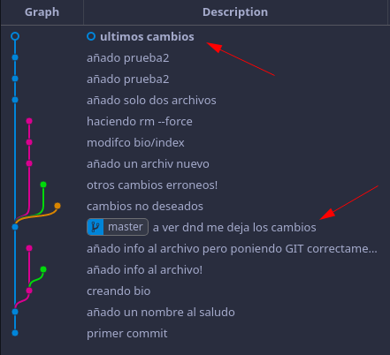

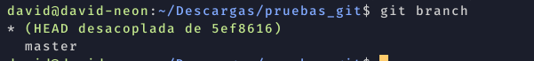

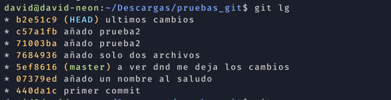

Si esto lo dejamos así git eliminará esa rama en la que se encuentra HEAD y perderemos los cambios. PAra arreglarlo tenemos que darle nombre a la rama con

```git
git branch nueva_rama b2e51c9

```

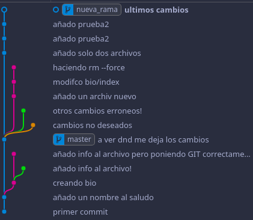

nos movemos a master y fusionamos ramas.

```git
git checkout master
git merge nueva_rama
```

finalmente borramos la rama creada (nueva_rama)

```
git branch -d nueva_rama
```

y tenemos la situación correcta.

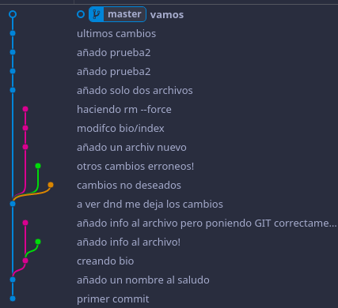

## Creación de ramas

Nos colocamos en nuestro último commit y creamos una nueva rama, esto creará una copia de nuestro proyecto.

```
git branch cabecera
```

Podemos crear una nueva rama y movernos a ella con

```
git checkout -b nueva_rama
```

con esto creo una nueva rama y la situación es la siguiente: tengo el HEAD apuntando al último commit de las ramas master y cabecera y m encuentro en master


Ahora me muevo a la otra rama

```
git checkout cabecera
```

Hay un comando que nos permite ver todas las ramas incluso las del remoto

```
git branch -a
```

Hasta ahora tenemos el comando `checkout`que nos permite cambiar entre ramas y tb deshacer cambios no deseados, por ejemplo añado contenido o creo un archivo que no es correcto para volver a tener el archivo como lo teníamos

```
git checkout -- nombreArchivo
```

Para hacer las cosas más claras surge

```git
git switch nombreRama # crea una nueva rama

git switch -c nombreRama # crea una nueva rama y nos desplaza a ella seria como un git checkout -b

git switch --orphan nombreRAma # crea una rama en blanco sin hisorial sin nada normalmente se usa para documentación

```

y hago cambios en los archivos. Al hacer commits de los cambios en la nueva rama, master se queda atrás. Si esos nuevos cambios funcionan bien puedo fusionar master con la rama creada para ello uso un merge desde master. En este caso no habrá problema xq en master no he modificado los archivos en el mismo punto que en la rama nueva así que se relaizará un merge automático .

```
git checkout master
git merge cabecera
```

Ahora bien si hago cambios en las mismas líneas de los archivos tanto en la nueva rama como en la master esto entra en conflictos y hay que resolverlos.
Cuando intente hacer el merge vscode me sacará una pantalla con los cambios de la rama donde estoy y los cambios de la rama que quiero fusionar y tengo que decidir con cual m qdo. Una vez modifico lo que necesito hago un nuevo commit

> El merge siempre hay que hacerlo desde master o bien desde la rama que queremos que continue(que quede viva)

### Enviar ramas a github

PAra ver las ramas en local hacemos

```git
git branch
```

Si queremos ver también las ramas que tenemos en remoto hacemos

```git
git show-branch --all
```

si queremos mandar una rama a github simplemente hacemos un push de la rama en cuestión

```git
git push origin nombreRama
```

Si queremos eliminar una rama en local hacemos

```git
git branch -d nombre_rama
```

si la rama tiene trabajos sin fusionar y aún así queremos forzar su borrado hacemos:

```git
git branch -D nombre_rama
```

Si queremos traernos una rama de github

```git
git pull origin nombreRaman
```

# Github

Podemos crear un repositorio en github y enlazar ese repo con el nuestro local para ello:

```
# Primero: Guardar la URL del repositorio de GitHub
# con el nombre de origin
git remote add origin URL

# Segundo: Verificar que la URL se haya guardado
# correctamente:
git remote
git remote -v

# Tercero: Traer la versión del repositorio remoto y
# hacer merge para crear un commit con los archivos
# de ambas partes. Podemos usar git fetch y git merge
# o solo el git pull con el flag --allow-unrelated-histories:
git pull origin master --allow-unrelated-histories

# Por último, ahora sí podemos hacer git push para guardar
# los cambios de nuestro repositorio local en GitHub:
git push origin master
```

## Llaves públicas y llaes privadas

Es un sistema para mantener encriptado el envío de información por internet.
Yo creo enviar datos a un usuario a través de internet. Creo mediante un algortimo matemático una llave pública y otra privada. Ambas forman parte del sistema de descrifrado. Te envío mi llave pública y el receptor codifica su mensaje con mi llave pública y m lo envía y solo con mi llave privada puedo decodificar ese mensaje.
Ahora para realizar lo mismo pero a la inversa y yo crear un mensaje cifrado el receptor tiene que enviarme su llave pública y así se cierra el círculo.

Hasta ahora nos conectábamos con github usando https pero si queremos añadir una capa más de seguridad debemos usar el sistema de llaves públicas/privadas, para ello debemos usar otro protocolo de comunicación `

` este tb se usa para comunicarse dos computadoras.

Para poder establecer una comunicación ssh con github tenemos que eviarle nuestra llave pública y github nos devuelve cifrada su llave pública. Este tipo de comunicación se establece por usuario(computadora) no por repo.

### Generando mis llaves public/private

Esta llave para usarla con github estará enlazada a un email así que
gnóthi seautón

```
ssh-keygen -t rsa -b 4096 -C "dmverges@gmail.com"
```

una vez hecho esto nos pedirá un lugar donde guardar nuestras llaves (lo dejamos por defecto) una passphrase como contraseña para nuestras llaves.

```
Generating public/private rsa key pair.
Enter file in which to save the key (/home/david/.ssh/id_rsa):
Created directory '/home/david/.ssh'.
Enter passphrase (empty for no passphrase):
Enter same passphrase again:
Your identification has been saved in /home/david/.ssh/id_rsa
Your public key has been saved in /home/david/.ssh/id_rsa.pub
The key fingerprint is:

```

y ya está creada esto genera en la ruta especificada (/home/tuUser/.ssh) dos archivos:

1. id_rsa => clave privada
2. id_rsa.pub => es la llave pública

Para que esto funcione tenemos que asegurarnos que el sistema ssh esté encendido en nuestro computador para ello

```
eval $(ssh-agent -s)
Agent pid 5505
```

Una vez hemos comprobado que ssh está funcionando hay que decirle que hemos creado una llave y la deje registrada para ello

```
ssh-add ~/.ssh/id_rsa
# Identity added: /home/david/.ssh/id_rsa (dmverges@gmail.com)
```

### crear conexión ssh con github

Ahora git solo funciona con conexión ssh así que debemos hacer esto para cada nuevo pc que usemos.

Copiamos nuestra llave pública y en nuestro perfil de github y en settings damos a ssh and GPG keys y añadimos una llave ssh.

Ahora vamos a nuestro repo y copiamos la url de ssh y en local añadimos remote origin usando la url de ssh.
en local comprobamos nuestros remotos

```
git remote -v

origin  https://github.com/davidMartinVergues/CURSO-GIT-GITHUB.git (fetch)
origin  https://github.com/davidMartinVergues/CURSO-GIT-GITHUB.git (push)
```

ahora editamos el origin

```
git remote set-url origin git@github.com:davidMartinVergues/CURSO-GIT-GITHUB.git
```

Al haber añadido una `passphrase` a nuestras llaves ssh cada vez que hacemos un push/pull nos pide esa passphrase así que para que ssh lo guarde y no nos lo ida más hacemos:

```
ssh-add

```

nos proguntará la passphrase para la ssh-key y listo

## Tags

Se pueden marcar los diferentes commits con tags para por ejemplo indicar una versión de nuestro proyecto. Para crear un tag:

```git
git tag -a v0.1 -m "añado un tag al commit" hashCommit
```

Para ver la lista de tags q tenemos:

```git
git show-ref --tags
```

Los tags son útilites sobre todo en github para que los colaboradores sepan en que versión estamos. Una vez añadido el tag debemos subirlo al repo remoto para ello:

```git
git push origin --tags
```

Para borrar un tag hacemos:

```git
git tag -d nombreDelTag

git push origin --tags
git push origin :refs/tags/nombreDelTag # para q lo borre github
```

# Nuevos comandos (makigas)

## git-restore

hasta ahora si queríamos deshacer los cambios hacíamos un `git checkout -- nombreArchivo` esto lo que hace es traer ese archivo del working directory de la rama actual y sobreescribe nuestro archivo, es decir deshace los cambios. ahora ha surgido un nuevo comando que hace lo mismo:

```
git restore nombreArchivo
git restore . # revierte todos los cambios efectuados en el repo
git restore --staged nombreArchivo # revierte todos los cambios cuando ya no estan en mi working directory sino en el stage después de hacer un add

```

Podemos ver los arhivos que está en el stage, es decir les hemos hecho el `git add ` antes del commit

```
git diff --name-only --cached
```

---

# Curso de Git y GitHub 

# TEMA 1

## ¿Cómo funciona GIT?

Básicamente con git conseguimos tener un proyecto distribuido. A ese proyecto de le denomina repositorio. Distribuido significa que cada integrante del proyecto tiene una copia de ese repositorio en local.
Git establece una línea del tiempo desde que se crea el repo hasta el día de hoy. Durante esa línea del tiempo vamos tomando fotografías de como se encuentra el proyecto, los llamados commits, de tal manera que siempre podremos volver a alguno de esos momentos.

Cosas a tener en cuenta:

Al importar un repositorio hecho en Linux en un entorno Windows el final de las líneas es diferente, en Linux usan LF (line feed) y en Windows CR (carriage return).

## Primeros pasos

Lo primero que debemos hacer es guardar un nombre de usuario y un mail en nuestra máquina para presentarnos quienes somos en GIT, estas credenciales serán las usadas en todos los repositorios que tengamos en local. Podemos optar por tener un nombre y un mail específicos por repositorio. Todo depende si añadimos al comando la palabra global.

> USAMOS: CONFIG GLOBAL

```
git config --global user.name david-winux
git config --global user.email dmverges@gmail.com
```

```
git config --global user.name "david winux"

```

Para saber si se ha guardado bien hacemos

```
git config --list --global
```


Podemos ir directamente al archivo q almacena esta información en `~/.gitconfig` (en nuestro directorio) y alterarla (no recomendable) mediante el comando:

```
git config --global -e
```

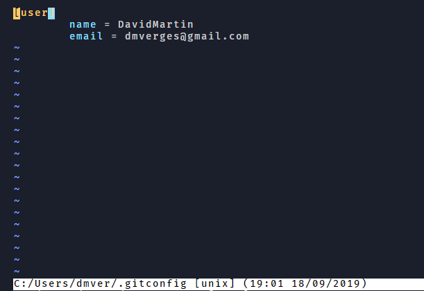

Para saber donde están todos los archivos de configuración de git

```
git config --list --show-origin
```

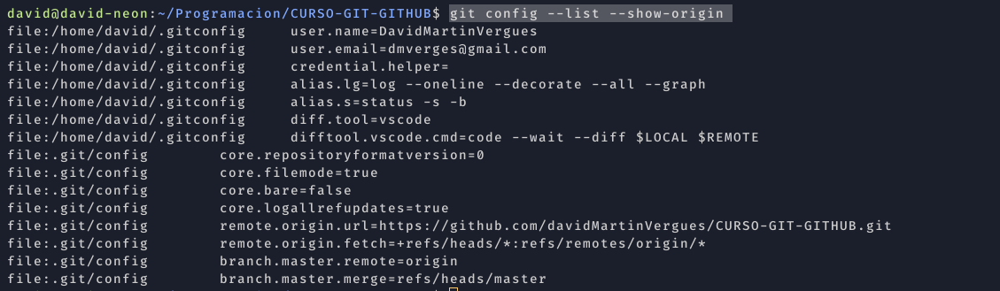

El repositorio local esta compuesto por tres "árboles" administrados por git. El primero es el Directorio de trabajo que contiene los archivos, el segundo es el Index(stage) que actua como una zona intermedia, y el último es el HEAD que apunta al último commit realizado.
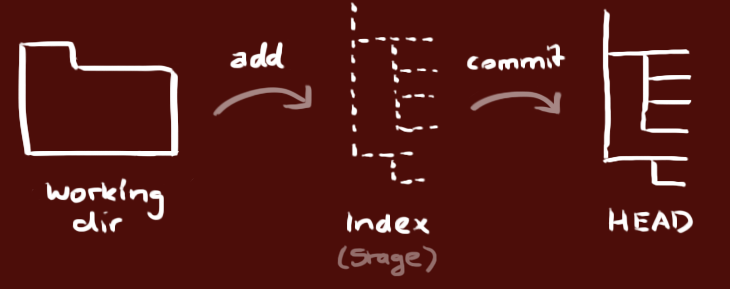

## Usando usuarios diferentes de manera local

Todas estas configuracones las hacemos globales, así que si queremos crear un repo local y usar unas credenciales locales distintas de las globales primero debermos establecer la configuración en local de usuario y del email.

```
git config --local user.name david-winux
git config --local user.email dmverges@gmail.com
```

Comprobamos que se ha escrito bien

```
git config -e --local
```

Y ahora **localmente** tenemos que borrar las credenciales que grabamos globalmente

```
git config --local credential.helper ""
```

Y cuando hagamos push ya nos pedirá las credenciales y no cogerá las locales.

> USAMOS: INIT STATUS ADD COMMIT .GITIGNORE

Cuando hacemos un init en nuestro repositorio local se crea la carpeta git donde estará todo lo necesario para guardar nuestros cambios.

```
git init
```

Luego creamos nuestros archivos

Cuando queremos ver el estado de git usamos `git status`


En satus nos separa los cambios hechos sobre archivos que ya están en seguimiento(ya se han registrado alguna vez) y archivos no rastreados (untracked)

Para poder registrar estos cambios o archivos/carpetas nuevos usamos:

```
git add .
```

El `.` indica que añada al stage todos los cambios realizados en el proyecto.

Esto los pone en el `stage`, es una zona previa donde se encuentran todos los cambios registrados para incluir en un commit.

Para tomar la foto del proyecto actual usamos:

```
commit -m “mensaje”
```

Resumen:

Con `git init` inicializamos el repositorio. Creamos los archivos necesarios. Con `git add .` ó nombre del archivo añadimos al stage esos archivos, después hacemos un `commit` que toma una foto de todos los archivos que hay colocados en el stage (escenario) para que git pueda registrar como se encuentran.

Si queremos descartar algún tipo de archivo, para q no sea seguido por git creamos un archivo `.gitignore` con la ruta a los archivos que no queremos controlar.

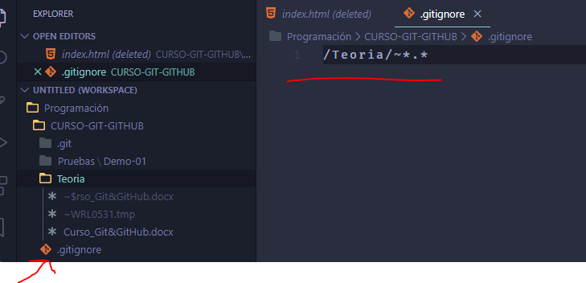

> USAMOS: CHECKOUT LOG

Imaginemos que por error modificamos un archivo o eliminamos su contenido. Con el comando `checkout` recuperamos el proyecto como estaba en el último commit. Esto también sirve para recuperar carpetas borradas

```
git checkout -- .
```

El comando `checkout`nos permite movernos entre ramas, en este caso `checkout -- .` lo que hace es reemplazar todos los cambios hechos en local con el contenido del `HEAD`.

A medida que vamos haciendo commits se va creando un registro con toda la información. Para acceder a este registro usamos:

```
git log
```

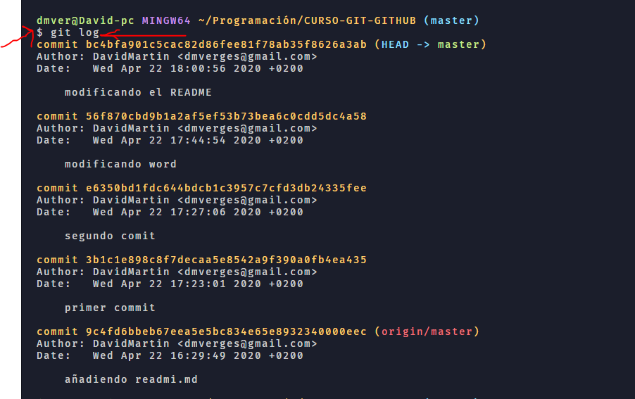

Lo correcto sería hacer commits por archivos, es decir si tenemos varios archivos modificados incluir cada uno de los archivos por separado y hacer el commit. Por jemplo hago el commit solo del index.

> USAMOS: ADD \*.PNG ADD CSS/ GIT ADD -A RESET

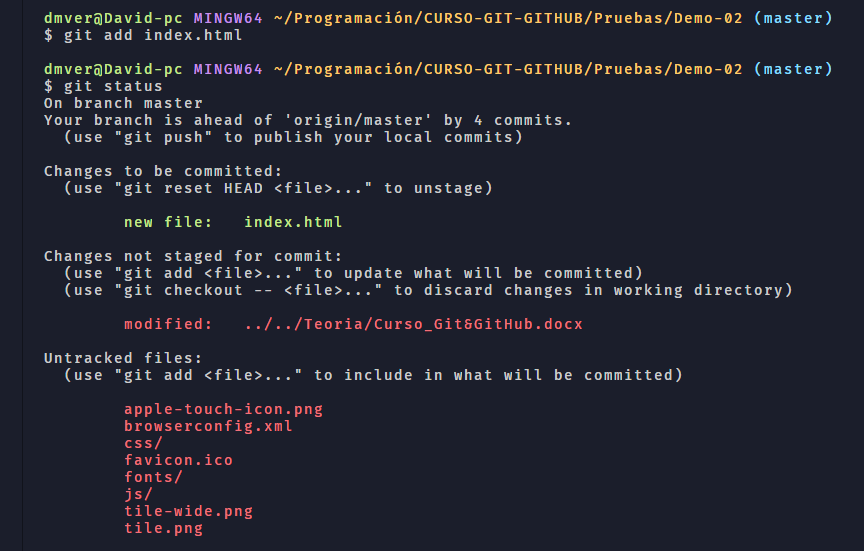

En la imagen vemos como index está en el stage y el resto de archivos en rojo todavía no.

Para añadir todos los archivos de un mismo tipo

```
git add \*.png
```


Hacemos el commit indicando que trackeamos el index y las imágenes.

```
git commit -m "agregando index e imagenes"

```

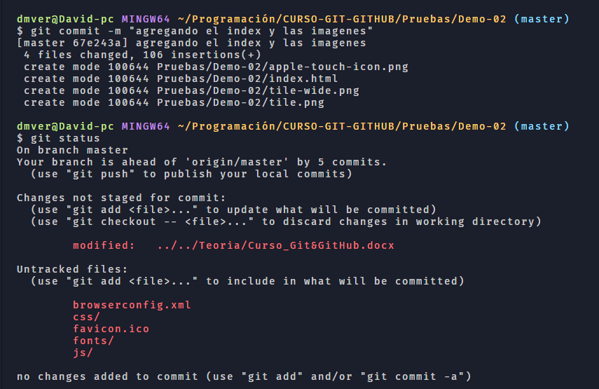

Agregar toda una carpeta el stage la de de css

```
git add css/

```

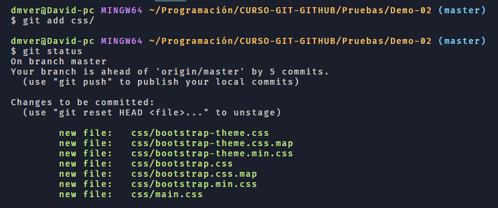

`git add -A` añadimos todos los archivos con cambios al stage pero si queremos descartar uno antes del commit hacemos un reset

```
git add -A
```

```
git reset *xml

```

## Tipos de add

1. Git add “\_.txt” => añade al stage los archivos txt modificados en todo el proyecto

2. Git add \_.txt => añade al stage los archivos txt modificados sólo en el directorio actual

3. Git add . => agrega todos los archivos modificados del mismo directorio

4. Git add --all
   Git add -A
   agrega todos los archivos modificados en todo el proyecto

5. Git add <file1.txt, file2.js> => agrega una lista de archivos.

6. Git add carpeta/\*.pdf => agrega todos los archivos de un tipo dentro de una carpeta

7. Git add carpeta/ => agrega todos los archivos dentro de una carpeta

## Dejar de seguir archivos

Una vez sabemos cómo añadir archivos al stage/en seguimiento por git también es importante saber cómo hacer q git olvide estos archivos o dejarlos de seguir para ello usamos el comando

```
git rm --cached nombreArchivo

```

si queremos q deje de seguir un directorio 

```
git rm -r --cached nombre_directorio
```
después de dejarlos de seguir añadimos al gitignore para q no nos lo suba al repo
## Como revisar el log

> USAMOS: log --oneline --decorate --all –-graph status -s -b

Cuando hacemos un log vemos el HEAD que nos indica el último commit de la rama en la que estamos, en este caso master

Todos estos flags me servirán para ver mejor el log cuando tengamos ramas y merges…

```
--oneline --decorate --all –-graph
```

Para ver el status actual de una manera resumida usamos:

```
status -s -b
```

-s (silence) -b (brach)

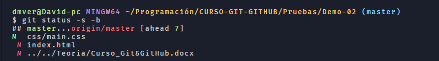

M rojo => modificados pero fuera del stage
M verde => modificado pero dentro del stage

El resto de flags de git status son:

1. C: copy of a file into a new one

2. D: deletion of a file

3. M: modification of the contents or mode of a file

4. R: renaming of a file

5. T: change in the type of the file

6. X: "unknown" change type (most probably a bug, please report it)

7. ??: significa que es un archivo sin seguimiento, para remediarlo hay que hacer un add

8. UU: updated/unmerge

9. MM: se da cuando hacemos un reset y modificamos un archivo aparece como modificado y como pendiente de añadir al stage

## Creando alias

Generar alias de forma global

```
git config --global alias.lg "log --oneline --decorate --all –-graph"
```

uno más completo

```
lg = log --graph --abbrev-commit --decorate --format=format:'%C(bold blue)%h%C(reset) - %C(bold green)(%ar)%C(reset) %C(white)%s%C(reset) %C(dim white)- %an%C(reset)%C(bold yellow)%d%C(reset)' --all
```

```
git config --global alias.s "status -s -b"
```

Lo que va detrás del punto en alias es cómo se llamará mi alias, en este caso “lg”

Para ver todas las configuraciones que vamos haciendo a nivel global hacemos un
`git config --global -e` ó también `git config –global -l`

# TEMA 2

## Uso de diff

> USAMOS: GIT DIFF –STAGED CHECKOUT – COMMIT -AM COMMIT –AMEND RESET --SOFT

Para saber que modificaciones hicimos en un archivo hacemos un diff, nos da las modificaciones entre el último commit y el momento actual.

Si quiero que sea vscode el que muestre las diferencias puedo incluir el siguiente código en el archivo .gitconfig en mi carpeta personal

```bash
[diff]
    tool = vscode
[difftool "vscode"]
    cmd = code --wait --diff $LOCAL $REMOTE
```

y por terminal para que me muestre el diff con vscode hago

```
git difftool origin/master
```

```
git diff
```

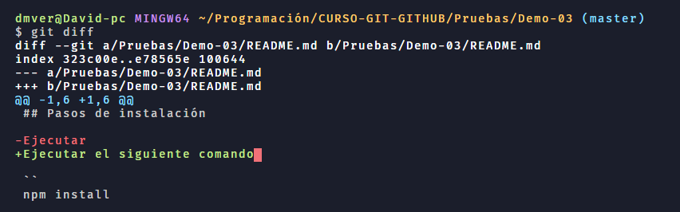

Incorporamos el archivo al stage

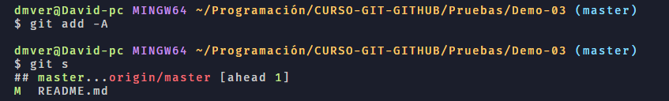

Ahora al ejecutar diff no nos muestra nada para saber las modificaciones de una archivo que ya está en el stage le añadimos

```
git diff --staged
```

Para entender el diff (comparación):

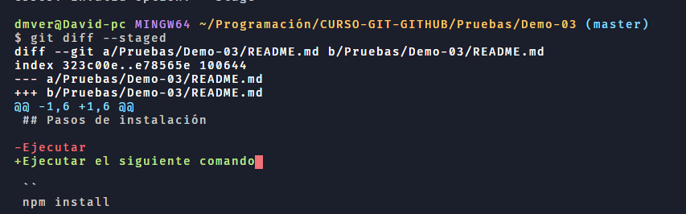

puedo usar diff para comarar dos commits ` git diff commit1 commit2` escrito de este modo cogerá como base el primer commit y lo comparará al segundo, de tal modo que me pondrá en rojo lo que "sobra" del commit1 y en verde lo que añadiría del commit2.

En verde o con el + / b es como está el archivo de la rama donde nos encontramos, es decir con los cambios  
En rojo o con el - / a es como estaba el archivo en el último commit

Podemos usar el diff para saber las diferencias entre dos versiones del archivo usando los identificadores de los commits

```
git diff 440da1c 07379ed
```

el primer identificador sería como la versión original y el último la más reciente

si queremos ver esos cambios en el entorno de vscode

```
git difftool 440da1c 07379ed
```

## Reset, sacando del stage

Ahora después de ver las modificaciones consideramos que es mejor la versión anterior así q lo sacamos del stage con reset

```
git reset README.md
```

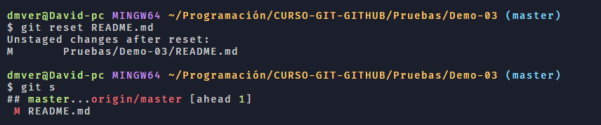

Y lo volvemos a la versión anterior con checkout –- nombreArchvo

```
git checkout -- README.md
```

Vemos como al hacer status ya no hay ningún archivo modificado pendiente de poner en el stage.
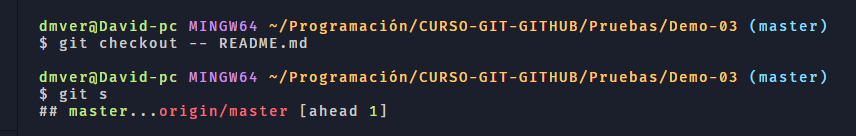

Si volvemos a modificar el archivo README.md añadiendo texto, como es un archivo ya en seguimiento (tracked) podemos hacer un add + commit al mismo tiempo con commit --am.

```
git commit -am "actualizando el README.md"
```

## Modificar mensaje del commit (--amend)

Como vemos el mensaje del commit está mal escrito para poder modificar un mensaje del commit usamos commit –amend(enmendar). Esto lo que hace es sustituir el mensaje del último commit por el que nosotros introducimos.

```
git commit --amend -m "corrijo el mensaje de actualizado README.md"
```

## Reset --soft modificando un commit

Partimo de la siguiente situación, útimo commit `a39895e`:

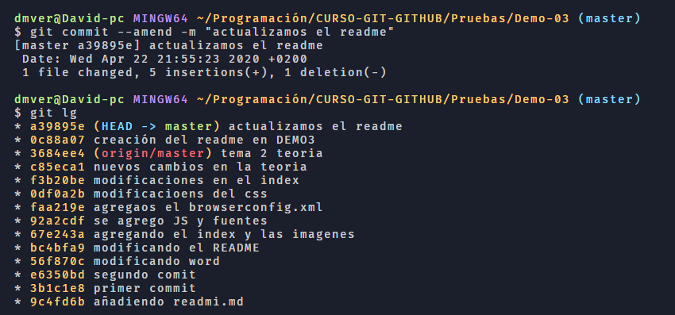

Queremos modificar el archivo README pero esas modificaciones deben estar asociadas a ese commit para ello usamos reset -–soft HEAD^ le coloco el ^ porque quiero volver al commit justo anterior (`0c88a07`) a donde apunta HEAD, que es el último.

```
git reset --soft HEAD^
```

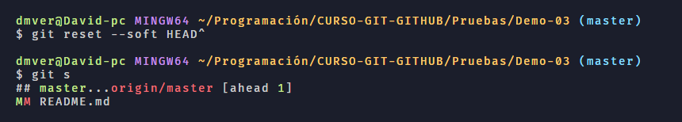

Vemos como el README está a la vez en el stage y modificado eso es porque hemos movido el HEAD, ahora HEAD apunta al comit anterior (`0c88a07`)


Pero seguimos teniendo el commit `a39895e` pero HEAD apunta al commit (`0c88a07`). Entonces modificamos el archivo y volvemos a hacer un commit lo que llevará los cambios al commit de arriba con las nuevas modificaciones incluidas pero el commit `a39895e` queda colgado, sin continuidad en nuestra línea y se genera un nuevo commit.

Así si hacemos un log queda así:

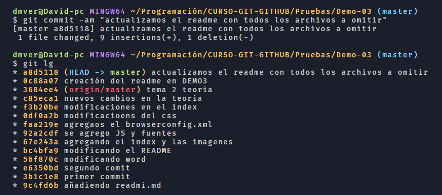

visualmente sería así

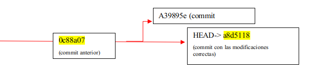

En lugar de usar HEAD^ podemos añadir el id del commit al cual queremos volver.

Yo tengo este log:

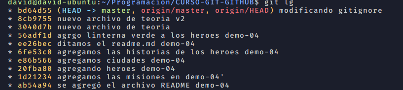

y quiero modificar el commit donde agrego linterna verde entonces voy al commir anterior el `ee26bec`

```
git reset --soft ee26bec
```

Ahora vemos como el HEAD apunta a este commit

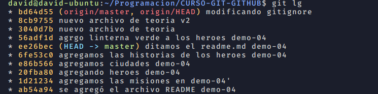

Una vez aquí hago las modificaciones en el archivo del commit (heroes).

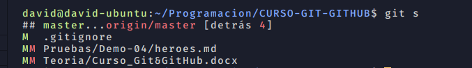

Si miramos la forma extendida se entiende mejor

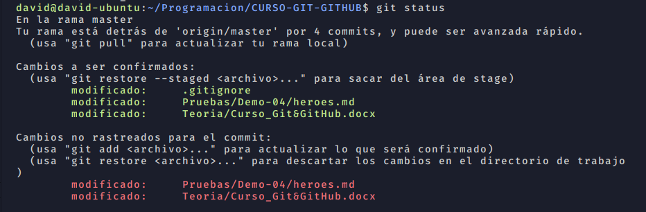

Tenemos que hay archivos incluidos en el commit pero como hemos vuelto a ese commit y hecho nuevas modificaciones nos lo pone también como pendiente de agregar al commit por eso aparece la doble **MM**

Agregamos los cambios al stage

```
git add -A
```

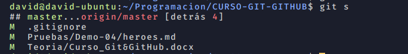

Y hacemos el commit

```
git commit -m "agregamos a linterna verde y a otro heroe"
```

Ahora si hacemos un log vemos el camino


> USAMOS: MERGE

Ahora vemos como el origin con sus commits que quiero mantener están en otra línea que el local por lo que hay que mergearlos para incluir todos esos cambios con la nueva línea local.
Antes de nada guardo todos los archivos abiertos como por ejemplo el word con la teoría por eso me obliga a hacer añadirlo al stage

Lo que hago es mirar el status veo que efectivamente teoria esta fuera del stage lo agrego y hago un commit

Ahora en local no tengo archivos con cambios y puedo proceder al merge

Obviamente cuando intento el merge me dice que hay conflictos por que los archivos modificados en local no concuerdan con los de origin(los de gitHub) estos archivos son el de heroes.md y el word de teoria, si hago un status veo como estan marcados con el flag **UU** que significa updated/unmerged.

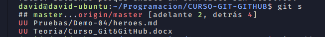

Pero que pasa que el .md el vsCode me muestra las opciones que tengo de manera grafica y me compara ambos archivos así yo puedo elegir con que cambios me quedo así que resulelvo ese comflicto y lo mergea. Así que decido no hacer nada con el word y añado ambos archivos directamente al stage

Aquí ya me dice que master (local) está adelantada 2 commits y origin/master (la de gitHub) atrasada 4. Así como me decía anteriormente q después de solventar los errores hiciese un commit y aunque solo he solventado el de heroes.md hago el commit a ver que pasa Y PARECE QUE FUNCIONA.


Ha incluido en la misma línea de tiempo los commits del local con los de origin y al hacer el último commit parece que todo acabe allí pero me head local apunta al último commit, lo que es correcto, pero origin está por detrás por lo que tengo q hacer un push para igualarlos.

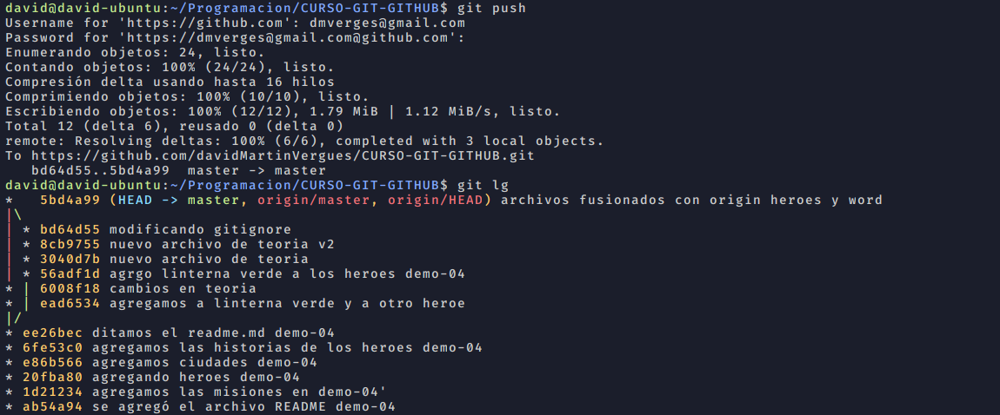

Ahora ya tengo HEAD/master y origin apuntando al mismo commit.

## Reset - -mixed - -hard - - reflog

Ahora lo tenemos todo bien y actualizado pero imaginemos que todos esos commits no nos sirven ya y queremos volver a un commit anterior para volver a comenzar desde allí para eso usamos reset mixed

Yo tengo esto


y quiero volver al punto dnd empieza la bifurcación `ee26bec` para ello uso un reset - - mixed

```
git reset --mixed ee26bec
```

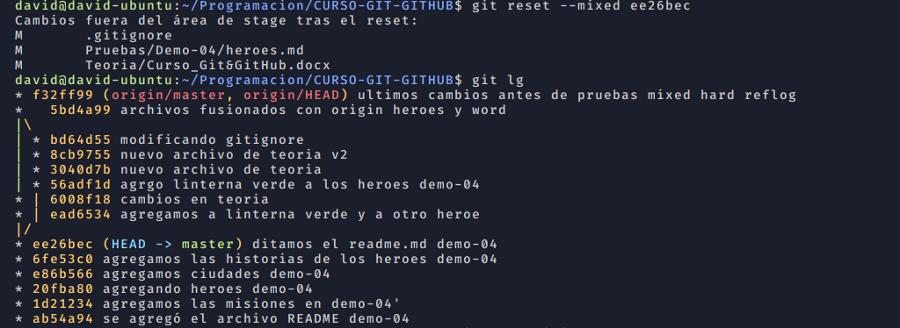

Vemos el head que apunta al commit escogido también aparece los archivos modificados entonces pero en pricipio todos los cambios se mantienen como los teníamos pero lo único es que están fuera del stage. Ahora si realmente queremos eliminar esos cambios y quedarnos en ese commit para trabajar a partir de ahí debemos hacer un reset --hard al mismo commit

```
git reset --hard ee26bec
```


En el árbol sigue igual pero si vamos a los archivos implicados como .gitignore heroes.md y el word se han perdido todos los cambios hechos después de ese commit `ee26bec`.

Sigamos bajando en el árbol y veremos como van desapareciendo los archivos, bajaré hasta donde agregamos las misiones

El HEAD lo tenemos casi al principio del proyecto y nos ha desaparecido casi todo

Solo tenemos esos dos archivos en el proyecto y la teoría también se ha perdido.

Pero ahora queremos recuperar todo lo borrado pero en el log ya no aparecen (a mi sí pq trabajo con gitHub y como el origin/master está al principio y como no hice push pues lo mantiene).

GIT mantiene todo un registro de los pasos q vams dando así que aunq en local haya perdido todos los commits y los archivos con la instrucción `reflog` veo todo los cambios efectuados en el árbol del tiempo y puedo volver a cualquier punto siempre que quiera

```
git reflog
```

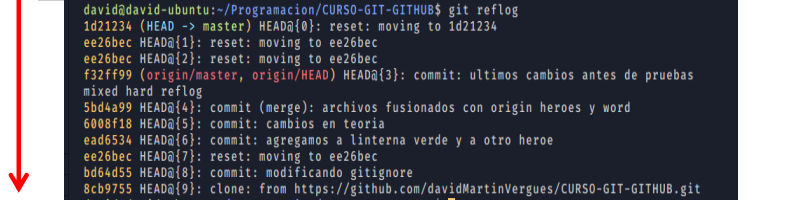

Me indica que mi HEAD está apuntando a ese commit y para abajo todos los cambios que he ido haciendo. Lo que yo quiero es mover a donde apunta origin y revertir todos los cambios hechos desde entonces. Ahora lo tengo así, sin teoría y solo dos archivos en mi proyecto, voy a hacer reset --hard al commit deseado `f32ff99`

```
git reset --hard f32ff99
```

Hacemos el reset

Y vemos como todo vuelve a como estaba

Recupero los archivos del proyecto y la teoria.

## Renombrar y eliminar archivos con GIT

### Con terminal

> USAMOS: MV RM

Si usamos la terminal para renombrar conservaremos toda la historia de ese archivo, no será considerado un archivo nuevo.

En mi caso tengo un directorio, Pruebas que quiero renombrar a T1_GIT_Basico utilizo el comando mv de esta manera (git mv nombre_archivo_antiguo nuevo_nombre):

Vemos como todo el contenido del directorio se va renombrando con la nueva ruta
R de rename. Ese cambio está en el stage así que para confirmar el cambio hay que hacer un commit.

Vemos como no queda nada en el satge y se ha confirmado el cambio.
Si queremos eliminar el archivo usamos rm y lo mismo se nos quedará el cambio en el stage y luego confirmamos con un commit

D de delete.
Si borramos un directorio con contenido tenemos q añadir el flag `-r` recursivo

### Con sistema de archivos

Si usamos el sistema de archivos para hacer cambios en nuestros proyecto debemos proceder de la siguiente manera para que git entienda los cambios.

1. Hacemos la modificación (cambiar el nombre de un fichero)

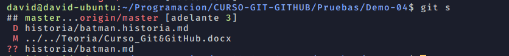

Git interpreta que hemos eliminad un arcivo y hemos creado otro nuevo, así que debemos registrar el cambio como un update.

**??** significa que es un archivo sin seguimiento, para remediarlo hay que hacer un add

**D** delete, archivo eliminado
**M** modified, archivo modificado

2. Hacemos un update

```
git add -u
```

Este comando nos permite añadir al stage solo aquellos archivos modificados/eliminados sin añadir los que no estan en seguimiento.


Hemos subido al stage el delete pero no ha añadido el nuevo. Para que lo reconozca como un renombramiento hacemos un -A

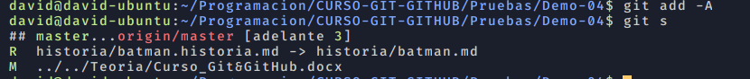

Para confirmar el cambio hacemos el commit
Si eliminamos el archivo es lo mismo primero un add -u y después un commit

Ignorar archivos en git - .gitignore
Este archivo debe ir en la raíz del proyecto.
En cada línea de este archivo debe tener una expresión para gnorar ciertos archivos.

## Flujo básico de trabajo con GIT


Cuando hacemos `git init` en el directorio raíz de nuestro proyecto pasan dos cosas:

1. se crea un espacio en memoria RAM llamado `staging`, donde se irán agregando los cambios es decir cuando hacemos un `git add .`
2. Se crea un repositorio, es la carpeta `.git` del proyecto, es donde se guardan los cambios definitivos del proyecto los `commits`. El nombre por defecto del repositorio es `master`. Cuando se hace el commit se le da un identificador.

Cuando hemos cometido un error y queremos recuperar ese archivo o proyecto tal y como lo teníamos en el repositorio master, es decir en el último commit hacemos un `git checkout`.

# TEMA 3 - RAMAS CONFLICTOS Y TAGS

## Definición

Una rama no es más que una línea del tiempo alterativa a la línea principal (master). En esa rama podemos hacer nestras modificaciones añadir funcionalidades al proyecto sin alterar el proyecto principal, si posteriormente se aceptan los cambios y todo funciona bien se puede agregar al proyecto principal, rama master, lo que llamamos merge.
Hay tres tipos de merge:

1. Fast-forward => éste se da cuando en la rama master no ha habido ningún cambio desde que se separó la rama secundaria así que simplemente GIT incorpora los cambios a la principal cerrando la secundaria.
2. Merge automático => es cuando sí ha habido cambios en la rama principal (master) pero no en archivos comunes entre la rama secundaria y master así que git vuelve a incorporar los cambios sin ningún problema.
3. Merge manual=> en este caso git solicita una solución manual ya que que la rama secundaria ha modificado archivos que también se encuentran en la principal. Así una vez resulete el cnflicto se debe realizar un merge commit.

A estas ramas se les da un nombre para identificarlas por ejemplo rama 'uix del carrito'. Cuando en la rama master se encuentra un bug se suele crear una rama para solucionar ese fallo, normalmente a esa rama se le llama `hotfix` o `bugfixing`. Una vez soolucionado se hace el merge entre master y el hotfix, al finalizar el merge tenemos la última versión de master a esta última versión se le llama `HEAD`

### Fast-forwars

> USAMOS: BRANCH DIFF -D

1. En nuestro proyecto Demo-06 creamos un archivo, villanos, pero no estamos seguros si incluirlo en master así que creamos una rama llamada villanos.

2. Creamos la rama con git banch

3. nos movemos a la rama deseada con un checkout

4. Añadimos villanos al stage

Vemos como nuestro HEAD apunta al último commit de la rama donde nos encontramos, master está un commit por debajo.
Editamos de nuevo el fichero y hacemos un nuevo commit en la rama villanos

5.  Integramos la nueva rama con la master, antes mirareos la diferencia entre las ramas con diff

Vemos como indica que en la rama a(villanos) tenemos un archivo villanos que en la rama b (master) no existe. 6. Para fusionar las ramas lo que queremos es fusionar la secundaria con la primaria pero partiendo de master así que volvemos a master y hacemos un merge.

Ahora vemos como master y rama-villanos apuntan al mismo commit. Una vez terminado el trabajo en la rama secundaria es bueno cerrarla para ello git branch -d

Merge automático

En esta ocasión creamos una nueva rama y nos movemos automáticamente a ella.

Modificamos el archivo villanos desde la rama nueva.

Hago un commit.
Ahora bien si me muevo a master ese cambio no aparece. Pero una vez en master hacemos una modificación sobre un archivo distinto. Así master modifico archivo heroes y desde rama-vilanos modifico el archivo villanos

Como ambas ramas hicieron un commit se ven representadas por separado.
Ahora quiero unir las dos ramas estando siempre en master. Como ambas ramas han trabajado sore archivos distintos el merge es automático. Me aparecerá para que incluya un texto para el commit.

Ahora veo como se han unidos las dos ramas

Los cambios de ambas ramas se reflejan en la rama master.
Finalmente borramos la rama secundaria.

Ya desapareció la rama-villanos2
Merge Manual o con conflictos

Creamos una rama llamada comflicto. Básicamente lo que haremos es modificar un mismo archivo desde ramas diferentes para crear un conflicto a resolver manualmente.

Ahí vemos los cambios realizados en ambas ramas. Cuando haga un merge me saltará el conflicto, tendré q resolverlo y luego hacer un commit. En VSCode me indica los conflictos gráficamente. Pero básiamente lo q no s hace git es escribir en el archivo unas etiquetas para indicar donde están los cambios...dejamos el archivo como queramos y hacemos un commit.

Visión gráfica

Esos son los dos cambios. Ahora manuelmente puedo arreglar como quiero q quede el archivo (quitando esas etiquetas de head y rama-conflicto) o bien darle a las sugerencias de vscode de aceptar uno u otro. Lo arreglo manualnete y hago el commit

Así es como se ven los archivos modificados pero no mergeados (UU ) y hago el commit.

Ya he fusionado ambas ramas y arreglado los conflictos, ahora borramos la rama secundaria.

# Tags o etiquetas

Son referencias a un commit en concreto, simplemente les damos un nombre a esos commit pej v1.0.1. Sirven para marcar versiones o release.

Para crear un tag y añadir un mensaje asociado a ese tag hacemos:

Y en el log ya vemos el tag

Podemos poner tag en cualquir commit utilizando su ID

Para ver el mensaje del tag usamos show, nos da toda la info relacionada con ese commit.

TEMA 4 - GIT STASH Y REBASE

STASH

Definición

Pongamos la situcación que tenemos un proyecto sobre el qe estamos trabajando en mejoras y añadiendo nuevos archivos pero todos estos cambios todavía no están probados pero hay qel problema que debemos desplegar el proyecto ya! Enntonces lo que hacemos es meter todos esos cambiosno probados en un stash, es como una caja donde poner los cambios y dejar el proyecto como estaba en el último commit. Posteriomente podremos recuperar todos esos archivos y agrgarlo al proyecto. Stash solo guarda archivos que etsán en seguimiento por GIT.
Ejemplo:
Modifico el archivo misiones

Pero tengo que desplegar master sin añadir ese cambio, pues uso el stash

WIP => work in progress
Ahora ya no tenemos el archivo pendiente de añadir al stage y la modificación realizada desaparece. Hacemos log

Para ver todos los WIP, trabajos en progreso hacemos list

Estamos en stash 0, podemos tener varios, lo bueno es ir eliminando stash a medida q vamos recuperando el trabajo.

Una vez hecho esto podemos seguir en master y podemos agregar algo q era muy necesario, p ej modificar el archivo README.md y hacemos un commit.

Una vez resuelto esto ya podemos volver a traer los cambios que teníamos en el stash para ello hacemos pop.

Así cogemos del stash todos los cambios y elimina de la lista de stashes. Sigue apareciendo el archivo como lo teníamos en ese momento y solo tenemos q hacer el commit. Incluso desaparece la referencia al stash en el log.

Cuando hacemos el pop puede que nuestros archivos entren en conflicto, entonces este se resolverá como de un merge se tratase, resolvemos el conflicto y hacemos un add y commit para confirmar los cambios.
Si tuvieramos más de un stash podemos aplicar/ recièrar el que nos interesa mediante git stash apply stash@{id del stash}

Para borarr las entradas del stash list utilizamos git stah drop, si lo dejamos así boraría el primero si nos interesa borrar uno en concreto seguimos con la posición deseada.
Rebase

Definición

Imaginemos que de master sacamos una rama y vamos trabajando en ella, hemos hecho unos cuantos commits, pero resulta que en la rama master también hemos ido avanzando y tiene commits, para poder actualizar nuestra rama e incluir los cambios hechos en master utilizamos el rebase. El rebase se tiene que hacer desde la rama secundaria y hacer git rebase master.
Git rebase master
Hay otro tipo de rebase, el llamado interactivo Git rebase -i HEAD~3esto lo que hace es recuperar, en este caso, los últimos 3 commits hechos antes del HEAD pero en lugar de HEAD podemos poner el hash de un commit. Al ejecuta esto lo que hace es guardar estos commit en una érea temporal para luego regresarlos a master en el mismo orden en el q estaban. Casos en los que utilizar el rebase interactivo son :

1. ordenar commits
2. Corregir mensajes de los commits
3. Unir commits
4. Separar commits.

Rebase para actualizar una rama secundaria

USAMOS: GIT REBASE NOMBRERAMA

Tenemos esta situación una rama master con dos commits y en paralelo una rama secundaria tb con dos commits, ahora quiero q la rama secundaria tb incluya esos commits de master, es decir actualizar mi rama secundaria.

Este movimiento es como si avanzáramos el incicio de la rama secundaria y esta ponerla al final del último commit de la master así cuando hagamos un merge de ambas nos hará un merge fast-forward y no nos dará conflictos.

1. Vamos a la rama secundaria
2. Hacemos el rebase con master
3. Volvemos a la master
4. Hacemos merge de la 2º a master
5. Borrar la rama secundaria

Aquí vemos como los commits de master ahora están por detras y los commits de la secundaria quedan delante de la línea temporal, ahora no nos diferencia estre ramas pero si nos fijamos tenemos master en un commit y dos por delante tenemos la rama secundaria.

Mergeamos:

Este merge es automático sin comflictos de ramas xq ya hemos actualizado anteriormente la rama secundaria con los cambios q había en master.

Uniendo dos commits

USAMOS: GIT REBASE -I COMMIT~X
La i significa interactive, rebase interactivo
Pongamos que hacemos dos commits consecutivos pero q los cambios son sobre el mismo archivo y deberían ir en un mismo commit, como se muestra en la foto

Hacemos un rebase -i

Para coger los últimos 4 commits partiendo de HEAD (este incluido).

Y nos salta esto

En rojo son los commits que hemos seleccionado con el rebase (el primero es el más antiguo). En azul aparecen las funciones que podemos hacer, la que nos interesa es el squash. Así que ponemos s delante del commit q queremos fusionar y este lo unirá con justo el anterior, de los 4 solo queremos fusionar los dos últimos

Salimos y nos aparecerá esta otra página para ponerle un mensaje al nuevo commit:

Cambiamos el mensaje del commit.

Guardamos y salimos y nos dará el commit:

Modificar el mensaje de un commit con rebase

1. Git rebase -i HEAD~1 (cogemos el último commit) y lo marcamos con r

2. Modificamos el mensaje

3. Guardamos y salimos

4. Como me pone q HEAD está desacoplado es bueno hacer un checkout a master para asegurarnos q no crea una rama nueva

Rebase edit

Imaginemos que modifico 3 archivos

Ups el readme la fastidié y tengo q revertir los cambios, pues hago un:
git checkout -- misiones.md

Los cambios en ese archivo se revierten y ya solo me aparece como pendientes 2 archivos.
Si ahora hacemos un commit de ambos archivos pero luego me doy cuenta que debería haber hecho un commit para cada archivo puedo usar rebase. Entonces aplicamos un rebase interactivo

Selecciono los últimos 4 commits y de esos edito el tercero, la intención es separarlo en 2 commits.

Guardo cambios salgo...y obtengo esta indicación:

Como yo no quiero cambiar el mensaje del commit paso de la recomendación y llevo el HEAD al commit justo anterior, revierte los cambios del último commit sin destruirlos.

Esto como estaba antes del reset y después veremos el HEAD apuntando dnd esta origin.

Pero sin revertir los cambios, solos los quita del stage. Los archivos siguen teniendo las modificaciones.

Ahora ya podemos poner cada archivo en un commit diferente.

Durante todo este proceso el HEAD no tenía rama pero eso es xq estamos en medio de un rebase, para volver el HEAD a una rama hacemos un rebase --continue.

TEMA 5 - GITHUB BÁSICO

GitHub - gitremote - push& pull

GitHub nos permite tener nuestro repositorio en la nube para evitar perder el trabajo si nuestro computadora se dañara.
Básicamente cuando trabajamos con repositorios remostos, por ejemplo en GitHub, tendremos que usar comandos como push, para subir los cambios o pull para bajar los cambios hechos por otra persona a mi proyecto.

Ahora bien git no maneja el acceso al repositorio, es decir todos los integrantes del equipo podrían acceder a todos los archivos del repo. Para controlar el acceso a un repo remoto podemos usar servicios de hosted como GitHub o BitBucket o utilizar una herramienta llamada Gitosis.

Flujo de trabajo con GitHub

1. Creamos un repositorio (vacío) en GitHub con el nombre que queramos.
2. Hacemos push desde nuestro repositorio local. Para ello basta con:

1.- añadimos un repositorio remoto con nombre `origin` y en la dirección especificada.
`git remote add origin https://github.com/davidMartinVergues/nombreDelRepo.git`
2.-fijamos que al hacer push lo haga de la rama master por defecto git
`push -u origin master`

el -u es una abreviación de --set-upstream, con esto fijamos que haga los push/pull de la rama master del repo del github que le hemos dado el nombre origin, si no existe esa en el repo remoto la creará.

3. Comprobamos que establecimos correctamente el repositorio remoto con git remote -v esto nos va a dar dos informaciones como se llama el repo remoto1, de donde coge los datos(o hace el pull)2, donde envía los datos3. Por lo general ambas direcciones, fetch y push, serán iguales.

4. Cuando hacemos push por defecto no sube los tags, para que lo haga debemos hacer un push específico para los tags git push --tags. Los tags me sirven pra marcar algo importante durante el desarrollo y desde gitHub tb podré bajar el repo tal cual estaba durante ese tag. Los tags en github se encuentran en la pestaña release.

5. Imaginemos que un compañero hace modificaciones en alguno de los archivos, si queremos descargarnos esos cambios necesitamos hacer un git pull.

Si empezamos de nuevo y nos queremos descargar el proyecto debemos usar git clone y la url del repo, si queremos q lo guarde en un directorio con un nombre diferente al del repo de GitHub a continuación de la URL podemos el nombre deseado.

Ahora en mi escritorio me ha bajado el proyecto con el nombre especificado

Git Fetch y Git Pull

1. Añadimos un héroe en heroes.md desde GitHub
2. Localmente también hago cambios pero en el README.md, hago el commit y si miro el status me indica q localmente está adelantado al remoto por un commit luego intento hacer el push que me sugiere.

Como modifiqué un archivo en GitHub antes de poder hacer un push desde local tengo que integrar los cambios con un pull y luego hacer el push. Pero si no sabemos los cambios efectuados en el remoto, si hacemos un pull directamente se hace también un merge para evitar eso usamos fetch que es como un pull pero si al hacer el merge hay conflictos, necesita comfirmación para hacer le merge.
git pull es una abreviación de git fetch seguido de git merge FETCH_HEAD.
El comando git fetch <repositorio> nos va a permitir recuperar todos los ficheros de un repositorio remoto que hayan sido modificados por otros colaboradores del proyecto y que actualmente no disponemos de ellos.
Git fetch tan sólo recupera la información del repositorio remoto y la ubica en una rama oculta de tu repositorio loca, para hacer referencia a esta información se crea una referencia llamada FETCH_HEAD, por lo que no la fusionará automáticamente con tu repositorio local. En este caso tenemos que saber que por cada repositorio remoto que tengamos configurado también tendremos una rama oculta de este.

Ahora puedo comprobar las diferencias entre mi repo local y lo que se ha traido fetch, almacenado en la variable FETCH_HEAD.

Una vez sabemos lo que va a cambiar podemos hacer el git pull o si seguimos con la secuencia lógica ya podemos hacer el git merge FETCH_HEAD.
Diff compara la rama local en la q m encuentro con el remoto, así en rojo me indica lo q me falta pero q sí está en remoto y en verde es lo que yo tengo local y falta en remoto.

Después del merge me dice q se ha modificado un archivo xo en el diff aparecían más diferencias, esto es xq el cambio que se ha producido en remoto ha sido solo en el archivo heroes no en el readme, a este lo q le pasa es q es diferente entre el local y el remoto. Así q para dejarlo bien ahora tengo q hacer un push para transmitir los cambios q he hecho en local en el readme a remoto.

Ahora en git m indica q he hecho un merge con master

Y cuando entro en readme veo los cambios y el mensaje del commit

Markdown

Titulos

Utilizamos #

Énfasis
_curtiva_ _cursiva_ **negrita** > citas

Listas

Imagenes


Links
[título del link](url del recurso)

Crando ramas en github

Vamos a crear una rama de nuestro proyecto en gitHub, haremos modificaciones y luego lo bajaremos a nuestro proyecto local.

1. Creamos archivo batman en historias y en lugar de subirlo directamente creamos una rama nueva y hacemos una solicitud de pull request para que otro compañero lo revise.

Se nos abre una ventana para hacer la solicitud del pull request

Ahora github hace una comparación entre los cambios propuestos por el pull request y la rama master si no hay comflictos se podrá mergear directamente.

Si le doy a ver los cambios

Le damos a finish my review y todos los comentarios hechos se irán visualizando en la pantalla de aprobación del pull request.

Finalmente hacemos un merge commit y ponemos un mensaje. Una vez hecho el merge nos da la opción de borrar la rama

Ya solo nos queda bajar ese archivo al local para ello podemos hacer directamente un pull o bien un fetch para ver los cambios y luego hacer el merge o si no hay conflicto y nos parece bien hacer el pull directamente.

Una vez tengo los cambios bajados los comparo

Solo queda hacer el merge con FEATCH_HEAD

TEMA 6 - GITHIB AVANZADO

Clone y fork

Cuando estamos trabajando en un repositorio propio o alguno público pero al que hemos sido agregados como colaboradors podemos hacer push sin problemas. Ahora bien, si nos clonamos un repo público pero del que no somos colaboradores, podremos hacer localmente lo que queramos ramas, commits, etc.. pero no podremos hacer un push al repo de github. Si queremos q los propietarios del repo valoren nuestros cambios hacemos un pull request.
Creando un fork

1. Accedemos a un repo público pero no somos colaboradores y hacemos fork
   a) https://github.com/Klerith/legion-del-mal
   b) Si le damos a Fork nos creará en nuestro usuario de gitHub un clone de ese repo  
   c) Al cual yo tendré total acceso  
   d) Si vamos a mi perfil veremos que está el repo con la indicación q es un fork

2. Hacemos clone de mi fork a nuestro sistema local, una vez allí podremos modificar lo que queramos.

Pull request

El pull request es una función a nivel de GitHub. Si el repo es mío pero uso el interfaz de gitHub para crear/modificar un archivo puedo escoger hacer un commit directo a master

O bien puedo hacer una rama. Si escojo hacer una rama sí o sí luego voy a tener que hacer un pull request para mergear rama-nueva con master lo que pasa que como soy el propietario del repo lo apruebo yo directamente. Otra opción es que la rama y los cambios los haga en local y como el repo es mío puedo hacer un push directamente y cambio el repo.
Ohora bien si yo no soy ni propietatio ni miembro de un repo aunque me clone el repo no me dejará hacer push así que el proceso es hacer fork (si el propietario del repo no confía en mi) o bien clonar y hacerme mi rama pero luego sí o sí voy a tener que hacer un pull request desde la interfaz de gitHub y esperar a que el pripietario me acepte los cambios.

Aohora queremos insertar nuestros cambios al repositorio originario de desde hicimos el fork. Para ello debemos asegurarnos que el remote apunta a nuestro usuario de gihub, que no esté al del repo original, para ello git remote -v.

1. Modificamos el repo local añadiendo una carpeta y hacemos un push a nuestro repo remoto

2. Iniciamos el pull request al repo original.
   a)

b) Nos aparece una pantalla con el resumen de los cambios que hicimos y lo que se verá afectado en la rama master del repo del cual hicimos el pull request.

c) Ahora el administrador del repo tiene que aprobar el pull request. Si vamos al repo veremos que tiene un pull nuestro

d) Volviendo a mi repo veré que tengo un pull request pendiente y si le doy me lleva a la historia completa

3. El propietario aceptas los cambios excepto borrar el espantapájaros. Hay que revertir ese cambio.
   a) Para ello miramos los logs e identificamos cuando borramos al espantapájaros

b) Hay varias formas pero una es volver al estado que tenía el archivo miembros en el commit justo anterior al de modificarlo para ello uso checkout. Yo tengo q hacer un ../ xq me encontraba dentro del directorio aspirantes.

c) y hacemos el commit con el archivo revertido. Subimos los cambios a nuestro repo, como teníamos pendiente un pull request con ese archivo no es necesario volver a hacer un pull request se carga directamente.

Work Flow con forks y repo central (upstream)

La situación es la siguiente, tenemos un repo central al que llamamos upstream. Sobre él dos compañeros hacen un fork y lo clonan en local, por lo que trabajan con el él y hacen push a su fork. Pero como podemos actualizar nuestro fork con los cambios que he hace el otro compi?.

Deberíamos primero hacer un pull del upstream a nuestro local, hacer los cambios pertientes y después hacer un push a nuestro fork y de este hacer un pull request al upstream. El problema es que ya tenemos un remoto en nuestro local, el fork inicial así que lo que hay que hacer es gregar un remoto más que apunte al upstream y hacer un fetch (cargar los datos nuevos) del upstream.

Me creo una nueva cuenta en gtHub y hago un repo

Con mi user de gitHub normal hago un fork y m lo clono en local.

Ya lo tengo como repo

Lo clono en local. Una vez lo tengo mi origin está apuntando a mi repo personal pero tengo q añadir otro remote (upstream).

Una vez así puedo elegir hacer un fetch del upstream para bajarme los cambios hechos por otros compañeros a mi rama local y de ahí a mi repo y una vez en mi repo hacer el pull request al repo inicial (upstream).

Comparo con lo que me he traido del repo upstream con un diff

cuando intento hacer el merge me salta un conflicto.
El motivo:
una vez hice el fork y cloné en local modifiqué el archivo y subi los cambios a mi repo privado (añadí modificaciones con user davidMartinVergues - Kubuntu), porteriormente desde github también modifiqué el archivo y haciendo una rama q después fusioné (añadí a propósito de actualizar el fork de otro usuario). Cuando ha ido a hacer el merge se ha encontrado con estos dos diferencias así que tengo q decidir como lo resuelvo hacer commit y subir lo q he resuelto. Me quedaré con el que proviene del upstream.

Ya solo queda subir los cambios a mi repo personal

Work Flow con ramas y repo central (upstream)

Hay dos maneras

1. Podemos actualizar directamente con un fetch, para comprobar cambios, y merge. Podemos movernos entre las ramas (checkout) , todos podemos hacer commits a master y push al repo remoto.

Para haer el push al repo, cambiaríamos a master, mergeamos con la rama q queramos y hacemos push al repo en gitHub

2. Usando los pull request así todos lo integrantes del equipo saben lo se esta haciendo y discutir los cambios antes de unirlos a master. Para ello en lugar de cambiar a master y hacer un push desde ahí a GitHub hacemos un push a la rama de GitHub y luego desde gitHub solicitamos un pull request para mergear con origin/master

Ejemplo de flujo

1. Creamos un archivo nuevo, villanos, y lo incluimos en una nueva rama.

2. Hacems un push a origin pero creando una rama, por lo tanto en gitHub.

3. vemos como en GitHub ya tenemos la rama

4. Ahora con la interfaz de gitHub comparermos ambas ramas y haremos pull request

5. Ahora todos los elementos del equipo verán que hay un pull request y si está bien harán el merge. Después borramos la rama. También podría asignarle el trabajo a alguien en concreto.

6. Ahora ya tengo en masterl nuevo archivo

7. Solo nos faltaría borrar la rama en local para ello primero hay q hacerlo desde master y luego esa rama la hemos mergeado en remoto pero no en local así para poderla borrar en local hay q hacerlo con -D

Pero esa rama remota queda almacenada en el cache local de git por lo q cuando hacemos un
branch -a sigue apareciendo

Para borrarla tb del caché la póxima vez que hagamos un pull o fetch añadimos el flag -p (prune)

El comando específico es git remote prune origin es algo así como actualizar referencias de origin.

8. Finalmente hacemos un pull para tener ese archivo en master local

Cuando clonamos un repo desde gitHub se crea una referencia por defecto q apunta a origin/master y esa referencia se qda cacheada en nuestro repo local, xo no es necesario borrarla.

En definitiva es como si solo tuviéramos 1 rama en remoto la origin/master.

Actualizar desde la rama de un compañero

1. Un compañero crea una rama-misiones y crea un archivo nuevo misiones.md
2. Hacemos en local un git pull para bajarnos la nueva rama hecha por nuesro compañero pero...

Cuando miro las ramas la nueva no apareceVeo q detecta la rama, cuando hago un fetch ne detecta la nueva rama pero al hacer git pull no me baja la rama, eso es porque no tengo habilitado el pull completo pra forzarlo hago git pull --all . 3. Una vez bajada la rama nos movemos a ella añadimos algo al archivo

4. Una vez modificado nos pide el compi q le subamos los cambios a su rama. Tengo q hacer el push a la rama-misiones de origin

5. Y una vez en github mergeamos con master
6. Durante el proceso hemos dejado varias ramas por el camino tanto en github como en local para borrlas:

Ahora localmente solo tengo master pero en remoto sigo teniendo la rama-misiones

Recordemos que en github aún está la rama-misones, para borrarla desde consola hacemos

Importante especificar los dos puntos q indican q eso se debe hacer en el remoto

Subiendo tags a github

Si tenemos issues abiertos en github siempre tienen asociado un numeral #5 por ejem

Si hacemos un commit q hace referencia a ese issue lo ponemos así

Y en github qda cerrado directamente.

Agregar colaboradores en un repo

APENDICES

Evitar que GIT pida credenciales en cada push a GitHub

Un repositorio git puede ser accedido utilizando distintos protocolos, de entre los cuales los más comunes son SSH y HTTPS.
HTTPS tiene algunas ventajas sobre SSH: Es más fácil de utilizar, porque no necesita la generación de un par de claves pública/privada, y normalmente no tiene problemas en atravesar firewalls y proxies. El inconveniente es que es necesario introducir el usuario y contraseña cada vez que se accede al repositorio remoto con una operación pull o push.
Pero también es posible configurar git para que almacene estas credenciales y las utilice cuando sea necesario, sin solicitarlas cada vez.

La manera más sencilla de evitar que git solicite usuario y contraseña cada vez, es establecer un asistente de credenciales en la configuración de git:
$ git config --global credential.helper store

Con esto, en el siguiente acceso que se realice al repositorio remoto, el usuario y contraseña introducidos quedan almacenados en un fichero ~/.git-credentials.
Si nos preocupa que la contraseña quede guardada en el disco duro, podemos utilizar un asistente de credenciales «cache». En este caso, la contraseña queda guardada en memoria, durante un tiempo limitado que se puede configurar (por defecto, 15 minutos). Por ejemplo, para utilizar este asistente, con una duración de una hora:
$ git config --global credential.helper 'cache --timeout=86400'

# Comandos útiles

# git branch -M main 

Para cambiar el nombre de una rama, primero necesitamos que esa rama tenga commits luego:

```
git branch -M main
```

## config -l

1. How to check your Git configuration:

The command below returns a list of information about your git configuration including user name and email:

```git
git config -l
```

## config --global

1. How to setup your Git username:

With the command below you can configure your user name:

```
git config --global user.name "Fabio"
```

2. How to setup your Git user email:
   This command lets you setup the user email address you'll use in your commits.

```
git config --global user.email "signups@fabiopacifici.com"

```

3. How to cache your login credentials in Git:

You can store login credentials in the cache so you don't have to type them in each time. Just use this command:

```
git config --global credential.helper cache

```

## git init

How to initialize a Git repo:

Everything starts from here. The first step is to initialize a new Git repo locally in your project root. You can do so with the command below:

```
git init
```

## git add

1. How to add a file to the staging area in Git:

The command below will add a file to the staging area. Just replace filename_here with the name of the file you want to add to the staging area.

```
git add filename_here

```

2. How to add all files in the staging area in Git

If you want to add all files in your project to the staging area, you can use a wildcard . and every file will be added for you.

```
git add .

```

3. How to add only certain files to the staging area in Git

With the asterisk in the command below, you can add all files starting with 'fil' in the staging area.

```

git add fil\*
```

## git status

How to check a repository's status in Git:

This command will show the status of the current repository including staged, unstaged, and untracked files.

```
git status

```

## git commit

1. How to commit changes in the editor in Git:

This command will open a text editor in the terminal where you can write a full commit message.

A commit message is made up of a short summary of changes, an empty line, and a full description of the changes after it.

```
git commit

```

2. How to commit changes with a message in Git:

You can add a commit message without opening the editor. This command lets you only specify a short summary for your commit message.

```
git commit -m "your commit message here"

```

3. How to commit changes (and skip the staging area) in Git:

You can add and commit tracked files with a single command by using the -a and -m options.

```
git commit -a -m"your commit message here"

```

## git log

1. How to see your commit history in Git:

This command shows the commit history for the current repository:

```
git log

```

2. How to see your commit history including changes in Git:

This command shows the commit's history including all files and their changes:

```
git log -p

```

## git show

How to see a specific commit in Git:

This command shows a specific commit.

Replace commit-id with the id of the commit that you find in the commit log after the word commit.

```
git show commit-id

```

## git log

How to see log stats in Git:

This command will cause the Git log to show some statistics about the changes in each commit, including line(s) changed and file names.

```
git log --stat

```

## git diff

How to see changes made before committing them using "diff" in Git:

You can pass a file as a parameter to only see changes on a specific file.
git diff shows only unstaged changes by default.

We can call diff with the --staged flag to see any staged changes.

```

git diff
git diff all_checks.py
git diff --staged
```

## git add -p

How to see changes using "git add -p":

This command opens a prompt and asks if you want to stage changes or not, and includes other options.

```
git add -p

```

## git rm

How to remove tracked files from the current working tree in Git:

This command expects a commit message to explain why the file was deleted.

```
git rm filename

```

## git mv

How to rename files in Git:

This command stages the changes, then it expects a commit message.

```
git mv oldfile newfile

```

## .gitignore

How to ignore files in Git:

Create a .gitignore file and commit it.

## git checkout

How to revert unstaged changes in Git:

```
git checkout filename

```

## git reset

How to revert staged changes in Git:

You can use the -p option flag to specify the changes you want to reset.

```
git reset HEAD filename
git reset HEAD -p

```

## git commit --amend

How to amend(enmendar) the most recent commit in Git:

git commit --amend allows you to modify and add changes to the most recent commit.

```
git commit --amend
```

!!Note!!: fixing up a local commit with amend is great and you can push it to a shared repository after you've fixed it. But you should avoid amending commits that have already been made public.

## git revert

How to rollback the last commit in Git

git revert will create a new commit that is the opposite of everything in the given commit.
We can revert the latest commit by using the head alias like this:

```
git revert HEAD

```

How to rollback an old commit in Git:

You can revert an old commit using its commit id. This opens the editor so you can add a commit message.

```
git revert comit_id_here

```

## git branch

How to create a new branch in Git

By default, you have one branch, the main branch. With this command, you can create a new branch. Git won't switch to it automatically – you will need to do it manually with the next command.

```
git branch branch_name

```

## git checkout

How to switch to a newly created branch in Git

When you want to use a different or a newly created branch you can use this command:

```
git checkout branch_name

```

## git branch

How to list branches in Git:

You can view all created branches using the git branch command. It will show a list of all branches and mark the current branch with an asterisk and highlight it in green.

```

git branch
```

## git checkout -b branch_name

How to create a branch in Git and switch to it immediately:

In a single command, you can create and switch to a new branch right away.

```
git checkout -b branch_name

```

## git branch -d branch_name

How to delete a branch in Git:

When you are done working with a branch and have merged it, you can delete it using the command below:

```

git branch -d branch_name
```

## git merge branch_name

How to merge two branches in Git:

To merge the history of the branch you are currently in with the branch_name, you will need to use the command below:

```

git merge branch_name
```

## git log --graph --oneline

How to show the commit log as a graph in Git:

We can use --graph to get the commit log to show as a graph. Also,
--oneline will limit commit messages to a single line.

```

git log --graph --oneline
```

## git log --graph --online --all

How to show the commit log as a graph of all branches in Git:

Does the same as the command above, but for all branches.

```

git log --graph --online --all
```

## git merge --abort

How to abort a conflicting merge in Git:

If you want to throw a merge away and start over, you can run the following command:

```

git merge --abort
```

## git add remote

How to add a remote repository in Git

This command adds a remote repository to your local repository (just replace https://repo_here with your remote repo URL).

```

git add remote https://repo_here
```

## git remote -v

How to see remote URLs in Git:

You can see all remote repositories for your local repository with this command:

```

git remote -v
```

## git remote show origin

How to get more info about a remote repo in Git:

Just replace origin with the name of the remote obtained by
running the git remote -v command.

```

git remote show origin
```

## git push

How to push changes to a remote repo in Git:

When all your work is ready to be saved on a remote repository, you can push all changes using the command below:

```

git push
```

## git pull

How to pull changes from a remote repo in Git:

If other team members are working on your repository, you can retrieve the latest changes made to the remote repository with the command below:

```
git pull

```

## git branch -r

How to check remote branches that Git is tracking:

This command shows the name of all remote branches that Git is tracking for the current repository:

```
git branch -r
```

## git fetch

How to fetch remote repo changes in Git:

This command will download the changes from a remote repo but will not perform a merge on your local branch (as git pull does that instead).

```

git fetch
```

## git log origin/nombreRama

normalmente el nombre que le damos a la rema en remoto es master o main

How to check the current commits log of a remote repo in Git

Commit after commit, Git builds up a log. You can find out the remote repository log by using this command:

```
git log origin/master

```

## git merge origin/master

How to merge a remote repo with your local repo in Git:

If the remote repository has changes you want to merge with your local, then this command will do that for you:

```
git merge origin/main

```

## git remote update

How to get the contents of remote branches in Git without automatically merging:

This lets you update the remote without merging any content into the
local branches. You can call git merge or git checkout to do the merge.

```
git remote update

```

## git push -u origin branch_name

How to push a new branch to a remote repo in Git:

If you want to push a branch to a remote repository you can use the command below. Just remember to add -u to create the branch upstream:

```

git push -u origin branch_name
```

## git push --delete origin branch_name_here

How to remove a remote branch in Git:

If you no longer need a remote branch you can remove it using the command below:

```

git push --delete origin branch_name_here
```

## git rebase branch_name_here

How to use Git rebase:

You can transfer completed work from one branch to another using git rebase.

```git
git rebase branch_name_here

```

Git Rebase can get really messy if you don't do it properly. Before using this command I suggest that you re-read the official documentation here
How to run rebase interactively in Git:

You can run git rebase interactively using the -i flag.
It will open the editor and present a set of commands you can use.

```git
git rebase -i master

```

p, pick = use commit
r, reword = use commit, but edit the commit message
e, edit = use commit, but stop for amending
s, squash = use commit, but meld into previous commit
f, fixup = like "squash", but discard this commit's log message
x, exec = run command (the rest of the line) using shell
d, drop = remove commit

## git push -f

How to force a push request in Git:

This command will force a push request. This is usually fine for pull request branches because nobody else should have cloned them.
But this isn't something that you want to do with public repos.

```
git push -f
```
## git remote set-url

cambiamos la url de un repo remoto

```
git remote set-url origin git@github.com:dmartin-projects/dmartin_projects.git
```
## git remote rm

si queremos eliminar la url de un remoto, no elimina el repositorio asociado solo la url

```
git remote rm heroku-web
```

# Tema 5 Undoing mistakes

##
